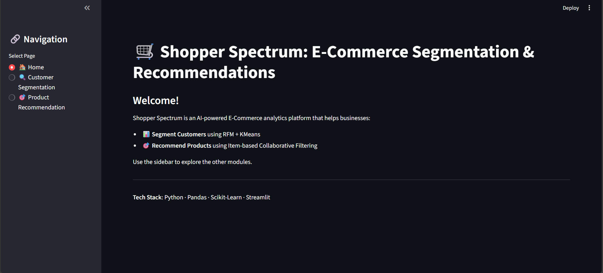
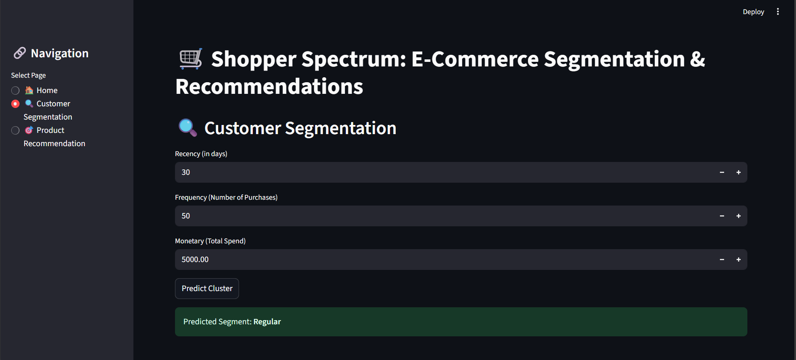
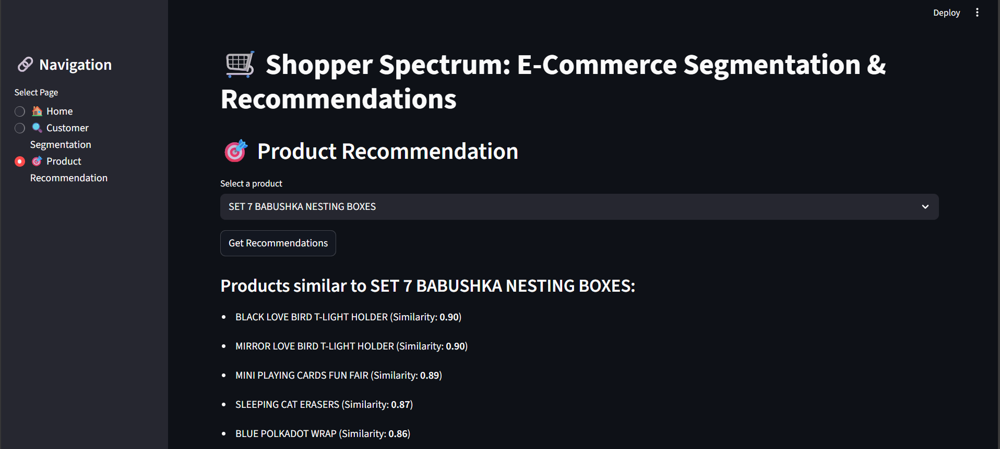

Here's your complete `README.md` file for the GitHub project **Shopper Spectrum**:

---

````markdown
# 🛒 Shopper Spectrum: Customer Segmentation and Product Recommendations in E-Commerce

This end-to-end machine learning project segments customers based on purchasing behavior and recommends similar products using collaborative filtering. Built using Python, the solution combines data preprocessing, clustering (KMeans), cosine similarity, and a clean interactive Streamlit interface for business-ready insights.

---

## 🚀 Project Overview

In the competitive e-commerce space, understanding customer behavior is crucial. This project explores a real-world e-commerce dataset to uncover customer patterns and make actionable insights available through:

- 🧼 **Data Cleaning & Preprocessing**
- 📈 **Exploratory Data Analysis**
- 📊 **RFM-Based Customer Segmentation**
- 🔁 **Collaborative Filtering for Product Recommendation**
- 🌐 **Streamlit Web App for Deployment**

---

## 📂 Files in this Repository

- `Shopper_Spectrum.ipynb`: Jupyter notebook containing the full EDA, preprocessing, clustering, and recommendation logic.
- `app.py`: Streamlit app file to launch the interactive web interface.
- `README.md`: This file describing the project.

⚠️ **Note**: Due to GitHub size restrictions, only code files are included. Download the dataset separately as shown below.

---

## 📥 Dataset

The dataset used in this project is based on **Online Retail** — a real-world e-commerce transactions dataset.

You can download it from this Google Drive link:  
🔗 [Download Online Retail Dataset (CSV)](https://drive.google.com/file/d/1rzRwxm_CJxcRzfoo9Ix37A2JTlMummY-/view?usp=sharing)

Once downloaded, place the file in your project directory and rename it as:  
📁 `online_retail.csv`

---

## ⚙️ How to Run the App

1. 📥 Clone the repository  
   ```bash
   git clone https://github.com/yourusername/shopper-spectrum.git
   cd shopper-spectrum
````

2. 📦 Install dependencies

   ```bash
   pip install -r requirements.txt
   ```

3. 🚀 Launch the Streamlit app

   ```bash
   streamlit run app.py
   ```

---

## 🧠 Key Features

### 🎯 Customer Segmentation (RFM + Clustering)

* RFM (Recency, Frequency, Monetary) scores calculated for each customer.
* Standardized and clustered using KMeans.
* Cluster segments: **High-Value**, **Regular**, **Occasional**, and **At-Risk**.

### 🛍 Product Recommendation (Collaborative Filtering)

* Cosine similarity computed between products using a Customer-Product matrix.
* Recommends top 5 similar items based on product selection.

### 🌐 Interactive Streamlit Web App

* Three navigable pages: **Home**, **Customer Segmentation**, **Product Recommendation**
* Built for business users to explore customer clusters and get recommendations.

---

## 📊 Sample Outputs

### 🖼 Streamlit App Preview

#### 1. Home Page



#### 2. Customer Segmentation



#### 3. Product Recommendation



---

## 📌 Problem Statement

How can we understand customer behavior, segment customers meaningfully, and recommend relevant products in an e-commerce business using past transactional data?

---

## 📒 RFM Full Form

* **Recency**: Days since the customer’s last purchase
* **Frequency**: Total number of transactions
* **Monetary**: Total amount spent

---

## ✅ Conclusion

This project delivers a comprehensive solution for customer segmentation and product recommendation. It’s highly adaptable for marketing teams, business analysts, or developers building recommendation pipelines.

> "Turning raw transaction data into actionable insights and personalized recommendations!"
